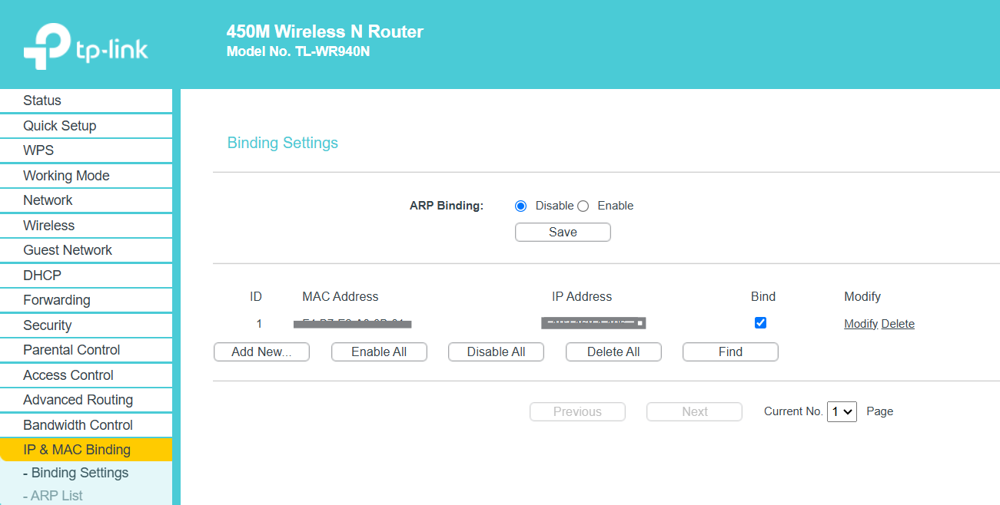

# Wi-Fi IP Reservation through MAC Address in Router

## Overview
This guide explains how to reserve an IP address for your Wi-Fi interface in your router using the MAC address. This ensures that your server always receives the same IP address.

## Steps to Reserve IP for Wi-Fi Interface in Router

### 1. Log into Your Router
- Open a web browser and type your router’s IP address (often something like `192.168.1.1` or `192.168.0.1`).
- Log in using your router’s username and password.

### 2. Find DHCP or LAN Settings
- Navigate to the DHCP or LAN section where you can manage IP addresses.

### 3. Set Up an IP Reservation
- Look for a DHCP Reservation or Static IP Assignment option.
- Add a new entry:
    - **MAC Address**: Replace colons with hyphens and use uppercase letters. For example, `F4-A0-3B-01-3B-01`.
    - **IP Address**: Set it to `192.168.1.106` or another desired IP within your router’s IP range.

### 4. Save and Apply
- Save the changes, and your router should now reserve the specified IP for this MAC address.

After setting this up, your server should receive the same IP address each time it connects to your network. If you need remote access outside of your local network, you would still need to set up port forwarding on this reserved IP and use a dynamic DNS service.

## Troubleshooting

### Invalid MAC Address Format
If your router requires the MAC address in the `XX-XX-XX-XX-XX-XX` format:
- Convert the MAC address `a0:f4:b7:e2:3b:01` to `F4-A0-3B-01-B7-E2`.
- Ensure the address is in uppercase letters.

### Additional Tips
- **Double-check the MAC Address Format**: Ensure you’re using the correct format.
- **Use the Correct Interface**: Ensure you’re using the MAC address for your Wi-Fi interface.
- **Clear Previous Reservations**: Check for any duplicates in your router’s IP reservation list.
- **Check Router Firmware**: Ensure your router firmware is up to date and reboot the router after making changes.
- **Try Another Device for MAC Verification**: Use a different device to double-check the MAC address settings.

If the above steps don’t help, contact your router manufacturer’s support for further assistance.
